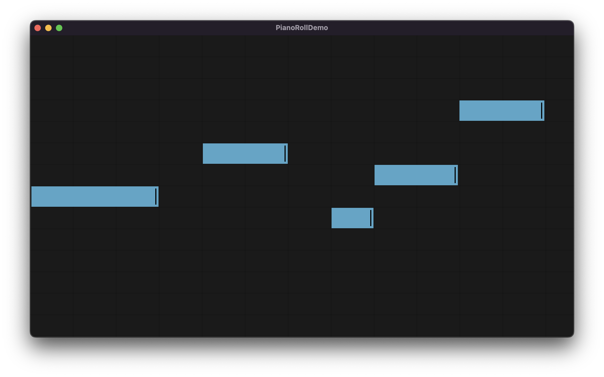

# PianoRoll
Touch oriented piano roll for iOS and macOS

## Documentation

Documentation appears [here](https://swiftpackageindex.com/AudioKit/PianoRoll/main/documentation/pianoroll).

You can also build documentation by choosing "Build Documentation" under the "Product" Menu in Xcode.

## Demos

The `Demo` directory contains project demos for iOS and macOS.

The `PianoRoll.playground` file is quick way to test the piano roll within Xcode.
